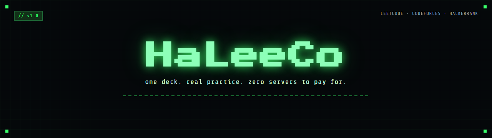
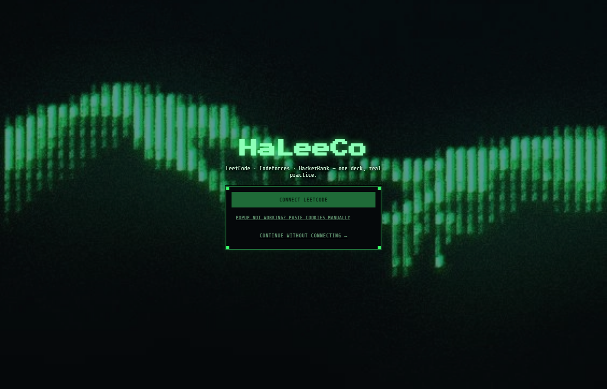
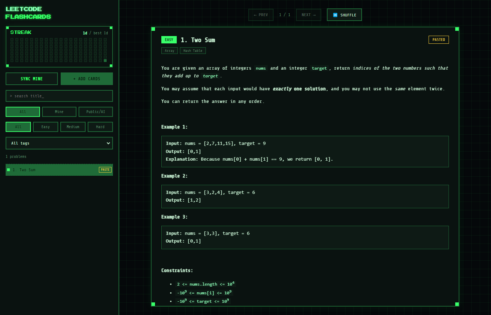
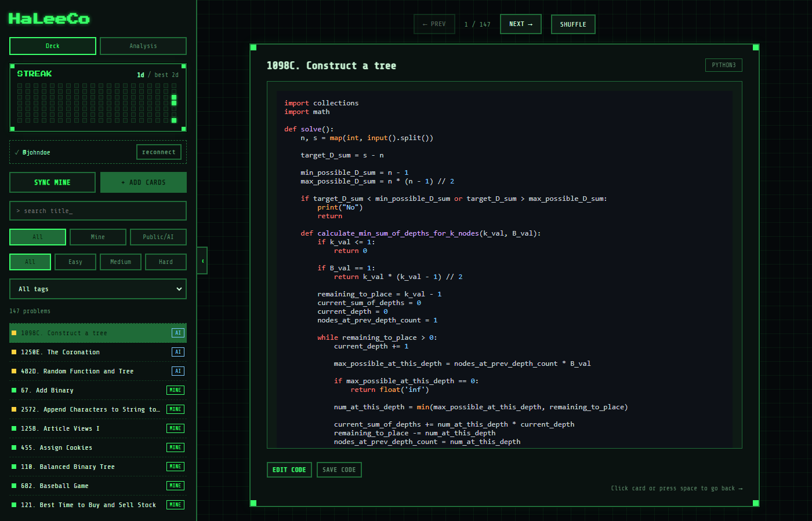
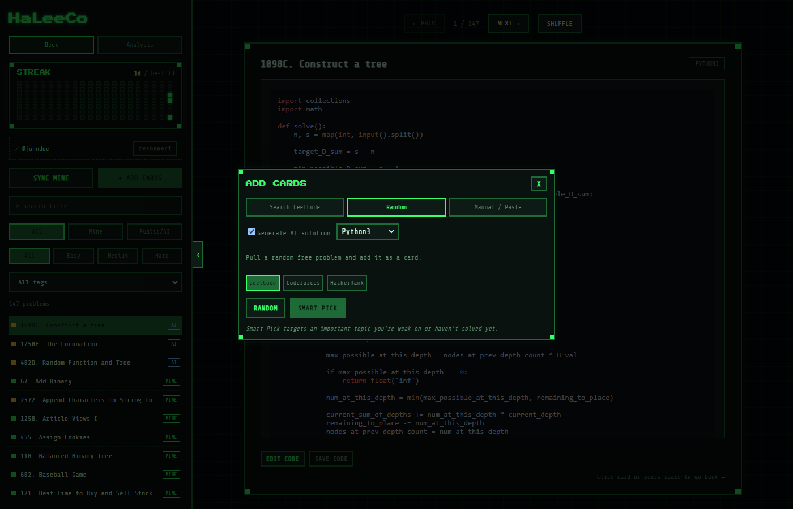
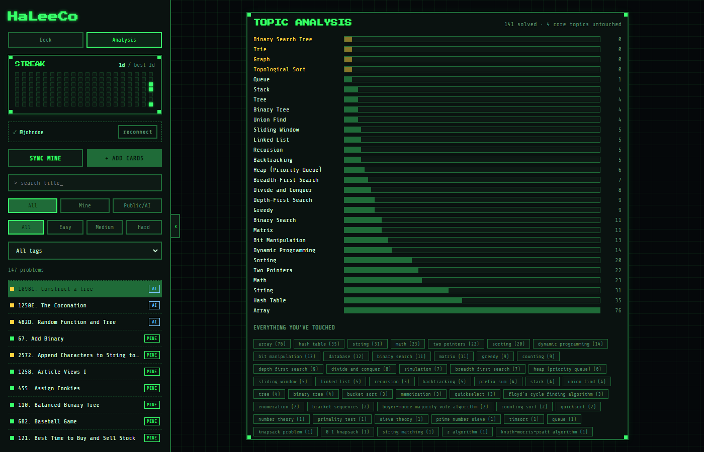

<div align="center">




A local flashcard deck for coding-interview practice, built across LeetCode, Codeforces, and
HackerRank — with a topic-analysis engine that tells you exactly what to practice next.

</div>

<br>

<div align="center">

| 3 | 28 | 0 | 100% |
|:---:|:---:|:---:|:---:|
| judges integrated | DSA topics tracked | servers to pay for | of your data stays local |

</div>

<br>

## Overview

**HaLeeCo** turns solved problems into flashcards — the question on the front, the code on
the back. Cards come from three places: your own real submissions (synced directly from your
account), any public problem across LeetCode, Codeforces, or HackerRank (search, random, or a
weak-topic-aware **Smart Pick**), or ones you write in by hand.

Nothing runs in the cloud. The backend is a small Node/Express service, the database is a
single SQLite file on disk, and the only network calls made are the ones you trigger —
to the judges themselves, and optionally to Gemini for solution generation.

<br>

## Features

**Connecting your account**
- One-click connect through a real, separate browser window — credentials are typed directly
  into the judge's own login page and never touch this app
- Manual cookie-paste fallback built into the UI, for environments where the browser flow
  can't complete
- Incremental sync of accepted submissions — only re-fetches what actually changed

**Building the deck**
- Search any public LeetCode problem by title
- Random problem pull from LeetCode, Codeforces, or HackerRank
- Smart Pick — same three judges, biased toward an important topic you're weak on or haven't
  attempted, instead of a uniform random choice
- Company tags — a one-click sync tags every LeetCode problem in your deck with which real
  companies have asked it (sourced live from a public community dataset, never bundled into
  this repo), filterable from the sidebar like any other facet
- Optional AI-generated solutions via Gemini, comment-free by default, with an automatic
  self-correction pass if the model adds one anyway
- Manual entry for content from any source

**Studying**
- **Today's Work** — a daily set of 5 real solves, scheduled by an actual SM-2 spaced-repetition
  algorithm: cards you get right come back further and further apart, cards you get wrong come
  back sooner, and a **Give me more (+5)** button extends the same day's set in further batches
  whenever you want to keep going
- A hard, AI-generated multiple-choice quiz on the algorithm and code behind each completed
  card — one question per card, graded automatically, and the grade feeds directly back into
  that card's SM-2 schedule
- Timed mock interviews — pick a duration and a problem count, work through them with the
  code hidden until time's up or you finish early, then self-rate and review against your own
  saved solution; past sessions are kept in a lightweight history
- Topic Analysis — every core DSA topic plotted against how many times you've solved
  something tagged with it, so gaps are visible at a glance
- Streak tracking with a contribution-graph-style heatmap, plus a running points total per
  day from completed cards and correct quiz answers
- Inline code editor, one-click code download, and a direct link back to the original problem
- Full keyboard navigation
- Offline-aware — reviewing a saved deck needs no internet connection; the app is explicit
  about which actions do

**Engineering**
- Fully local: SQLite on disk, both dev servers bound to loopback only
- Filterable by source, difficulty, tag, company, or title across the entire deck
- Export your whole deck to a JSON file and re-import it elsewhere — a real backup, not just
  a data dump
- Collapsible sidebar layout
- Automated tests (Vitest, backend logic + frontend components) and CI on every push
- Optional single-container Docker deploy with a no-login demo-data seed — see
  [DEPLOY.md](DEPLOY.md)

<br>

## Screenshots

<table>
<tr>
<td width="50%">

**Landing**


</td>
<td width="50%">

**Card front — full question**


</td>
</tr>
<tr>
<td width="50%">

**Card back — AI-generated code, no comments**


</td>
<td width="50%">

**Add Cards — three judges, Smart Pick**


</td>
</tr>
</table>

**Topic Analysis**


<br>

## Tech Stack

<div align="center">


</div>

| Layer | Technology |
|---|---|
| Frontend | React 19, TypeScript, Vite, DOMPurify, highlight.js |
| Backend | Node.js, Express, better-sqlite3 |
| Authentication | Playwright-driven browser login |
| AI | Google Gemini (`@google/genai`) |
| Data sources | LeetCode GraphQL, Codeforces REST + web, HackerRank internal REST, a public company-tag dataset fetched live |
| Storage | SQLite — single file, `server/flashcards.db` |
| Testing | Vitest + Testing Library (client and server), GitHub Actions CI |
| Deployment | Docker (multi-stage build), optional demo-data seed — see [DEPLOY.md](DEPLOY.md) |

<br>

## Quick Start

```bash
npm install
npm run setup:browser -w server   # one-time, ~150MB Chromium download for login
cp .env.example .env              # add GEMINI_API_KEY here for AI-generated solutions
npm run dev
# server -> http://localhost:5174 (loopback only)
# client -> http://localhost:5173
```

Open the client and select **Connect LeetCode**. A real browser window opens to LeetCode's
own login page — log in exactly as usual. Once authenticated, the app captures the session,
closes the window, and starts a sync automatically.

LeetCode's login page runs a bot-verification check that can stall indefinitely on a freshly
launched automated browser session — this is a platform-level limitation, not an application
bug. If the popup does not complete, use **"Popup not working? Paste cookies manually"** in
the UI: log into leetcode.com in your normal browser, open DevTools → Application → Cookies,
and paste the `LEETCODE_SESSION` and `csrftoken` values.

For AI-generated solutions, obtain a free key at https://aistudio.google.com/apikey and set
it as `GEMINI_API_KEY` in `.env`. Without it, imported public problems are created with blank
code and an inline editor for you to complete.

`.env` is gitignored — treat its contents as credentials.

Want to try it without any of the above? See [DEPLOY.md](DEPLOY.md) for a
one-command Docker build that seeds a small no-login demo deck instead.

<br>

## Testing

```bash
npm test -w server   # SM-2 scheduling, daily-set rotation, points — Vitest
npm test -w client   # component behavior — Vitest + Testing Library
```

Both run automatically on every push via GitHub Actions
([.github/workflows/ci.yml](.github/workflows/ci.yml)), alongside a full
client type-check and production build.

<br>

## Keyboard Shortcuts

| Key | Action |
|---|---|
| `Space` | Flip the current card |
| `→` | Next card |
| `←` | Previous card |
| `S` | Shuffle to a random card in the current filtered deck |

<br>

## Architecture

```
  real browser window        LeetCode / Codeforces / HackerRank        Gemini API
   (Playwright-driven)             session cookie / public reads         optional
             \                              |                              |
              \                             |                              |
               v                            v                              v
        [==================== server -- Express + SQLite ====================]
                                       |
                                       |  REST / JSON, localhost only
                                       v
        [==================== client -- React + Vite =========================]
```

`server/` runs the Express API and a local SQLite database. It drives a short-lived,
real Chromium window via Playwright for login, talks to each judge's own API or pages,
runs the topic-analysis and Smart Pick logic, and optionally calls Gemini for solution
generation.

`client/` is the React and Vite flashcard interface. No credentials are stored here —
every authenticated request is routed through the server.

<br>

## Project Structure

```
haleeco/
├── server/
│   ├── src/
│   │   ├── index.js            # Express routes
│   │   ├── db.js               # SQLite schema and queries
│   │   ├── leetcodeClient.js   # GraphQL - own submissions and public browsing
│   │   ├── codeforcesClient.js # Codeforces API and statement retrieval
│   │   ├── hackerrankClient.js # HackerRank internal REST endpoint
│   │   ├── companyTagsClient.js# live fetch of the public company-tag dataset
│   │   ├── importProblem.js    # shared public-problem import (route + demo seed)
│   │   ├── demoSeed.js         # DEMO_MODE no-login sample deck
│   │   ├── browserLogin.js     # Playwright login and manual-cookie fallback
│   │   ├── analysis.js         # topic coverage and weak-topic selection
│   │   ├── aiGenerate.js       # Gemini solution + quiz generation
│   │   ├── daily.js            # Today's Work: SM-2 rotation, quiz batching
│   │   ├── srs.js              # SM-2 spaced-repetition scheduler (pure logic)
│   │   ├── mock.js             # timed mock-interview sessions
│   │   ├── sync.js             # incremental sync of accepted submissions
│   │   └── util.js
│   └── test/                   # Vitest — srs.js, daily.js
├── client/
│   ├── src/
│   │   ├── App.tsx
│   │   ├── api.ts
│   │   └── components/
│   │       ├── LandingPage.tsx
│   │       ├── Sidebar.tsx
│   │       ├── FlashCard.tsx
│   │       ├── DailyWork.tsx
│   │       ├── MockInterview.tsx
│   │       ├── ErrorBoundary.tsx
│   │       ├── AddCardsPanel.tsx
│   │       ├── AnalysisView.tsx
│   │       ├── StreakBoard.tsx
│   │       └── ManualConnect.tsx
│   └── test/                   # Vitest + Testing Library
├── .github/workflows/ci.yml
├── docs/screenshots/
├── Dockerfile
├── DEPLOY.md
├── .env.example
└── README.md
```

<br>

## Roadmap

Shipped:

- [x] SM-2 spaced repetition for Today's Work
- [x] Automated test suite (Vitest) and CI (GitHub Actions)
- [x] Timed mock-interview mode with session history
- [x] Company-tagged problem sets, sourced live from a public dataset
- [x] Docker packaging with an optional no-login demo-data seed
- [x] Deck export/import as JSON

Planned:

- [ ] Actually host the public demo somewhere (the Docker image is ready — see
  [DEPLOY.md](DEPLOY.md) — this just needs a platform account to point at it)
- [ ] Automatic commit of solved code to a public GitHub repository

<br>

## Notes

- Your LeetCode session and Gemini key are real credentials. `.env` is gitignored and should
  never be committed. Sessions expire eventually — reconnect to renew.
- Your LeetCode password is entered directly into LeetCode's own login page inside a real
  browser window; it is never processed by this application's frontend or backend.
- Both development servers bind to `127.0.0.1` only and are not exposed on the local network.
- All data is stored in `server/flashcards.db`. Delete it at any time to reset.

<br>

<div align="center">

Built with Node.js, React, and a preference for keeping data local.

</div>
