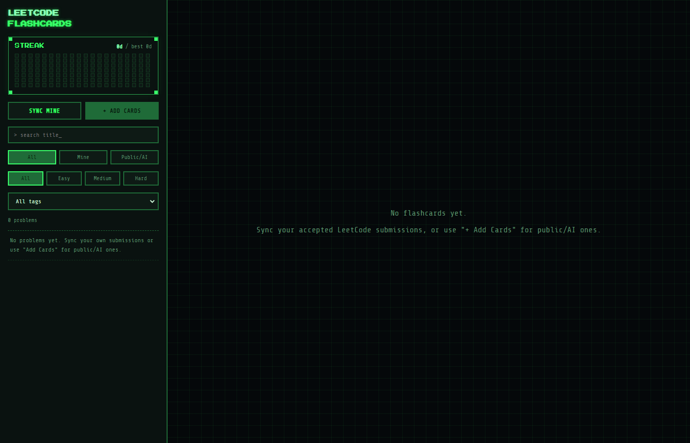

```
╔══════════════════════════════════════╗
║         LEETCODE FLASHCARDS          ║
╚══════════════════════════════════════╝
   > full question · testcases · code — as flip cards
```

<div align="center">


**A local, terminal-themed flashcard deck for LeetCode — your own solved problems, any public
problem, or ones you paste in yourself. Nothing leaves your machine except calls to LeetCode
and (optionally) Gemini.**

</div>

<br>

## ▓ What this is

Three ways a card gets into your deck:

| Source | How | Badge |
|---|---|---|
| **Your own solves** | Click **Connect LeetCode**, log in in the browser window that opens, done — auto-syncs right after | `YOUR SOLVE` |
| **Any public problem** | Search LeetCode by title, or hit random — free/non-premium problems only. Solution is Gemini-written if you opt in, otherwise blank for you to fill in | `AI GENERATED` or `PASTED` |
| **Paste it yourself** | A form for anything from a book, a blog, or an LLM you ran elsewhere | `PASTED` |

Flip a card to go from question → code. A sidebar streak board (GitHub-contributions-style)
tracks the days you've actually reviewed something.

<br>

## ▓ Screenshots

<table>
<tr>
<td width="50%">

**Deck + streak board**


</td>
<td width="50%">

**Add Cards — search any public problem**


</td>
</tr>
<tr>
<td width="50%">

**Card front — full question + testcases**


</td>
<td width="50%">

**Card back — syntax-highlighted code**


</td>
</tr>
</table>

<br>

## ▓ Features

- 🔗 **Connect LeetCode with one click** — logs in through a real browser window, no cookie-copying, no password ever touches this app
- 🔄 **Sync your own accepted submissions** — incremental, only re-fetches what changed, auto-runs right after connecting
- 🔍 **Search any public LeetCode problem** by title, or **🎲 random** a free one in
- ✍️ **Manual/paste mode** — hand-write a card from any source
- 🤖 **Optional AI-generated solutions** via Gemini (bring your own free API key)
- ✏️ **Inline code editor** on the card back — fill in blanks or fix anything, anytime
- 🔥 **Streak board** — a contribution-graph-style heatmap + current/longest streak
- 🎯 **Filter/search** by source (mine/public), difficulty, tag, or title
- ⌨️ **Keyboard-driven**: `Space` flip · `←/→` navigate · `S` shuffle
- 🖥️ Fully local — SQLite on disk, servers bound to `127.0.0.1` only

<br>

## ▓ Quick start

```bash
$ npm install
$ npm run setup:browser -w server   # one-time, ~150MB Chromium download for login
$ cp .env.example .env              # add GEMINI_API_KEY here if you want AI solutions
$ npm run dev
# server → http://localhost:5174 (loopback only)
# client → http://localhost:5173
```

Open the client and click **🔗 CONNECT LEETCODE**. A real browser window opens straight to
LeetCode's own login page — log in exactly like you always do (password, Google, GitHub,
whatever). The app polls in the background, and the moment you're logged in it grabs the
session, closes that window, and **kicks off a sync automatically.** No DevTools, no copying
tokens, and your password never passes through this app — you type it directly into LeetCode's
real page.

(Optional) For AI-generated solutions on imported/random public problems, grab a free key at
https://aistudio.google.com/apikey and drop it into `.env` as `GEMINI_API_KEY`. Without it,
those cards come in with blank code and an inline editor to fill in yourself.

<details>
<summary><strong>Advanced: manual cookie setup</strong> (if the browser login doesn't work for your setup)</summary>

<br>

Log into leetcode.com → DevTools → Application/Storage → Cookies → `https://leetcode.com`,
copy `LEETCODE_SESSION` + `csrftoken`, and paste them into `.env`:

```
LEETCODE_SESSION=...
LEETCODE_CSRFTOKEN=...
```

</details>

`.env` is gitignored — these are credentials, treat them like passwords.

<br>

## ▓ Keyboard shortcuts

| Key | Action |
|---|---|
| `Space` | Flip the current card |
| `→` | Next card |
| `←` | Previous card |
| `S` | Shuffle to a random card in the current filtered deck |

<br>

## ▓ How it's built

```
  [ real browser window ]     [ LeetCode GraphQL ]      [ Gemini API ]
    you log in here              session cookie            optional
    (Playwright-driven)          + public, no-login
             \                        |                       |
              \                       |                       |
               v                      v                       v
        [========== server — Express + SQLite ==========]
                              |
                              |  REST / JSON, localhost only
                              v
        [========== client — React + Vite ==========]
```

- **`server/`** — Express API + a local SQLite DB. Drives a short-lived, real Chromium window
  (via Playwright) for login, talks to LeetCode's GraphQL endpoint (authenticated for your own
  submissions, public/no-login for browsing any problem), and optionally calls Gemini for
  solution generation.
- **`client/`** — React + Vite flashcard UI. No secrets live here — everything credentialed
  goes through the server.

<br>

## ▓ Project structure

```
leetcodefcs/
├── server/
│   └── src/
│       ├── index.js          # Express routes
│       ├── db.js             # SQLite schema + queries
│       ├── leetcodeClient.js # GraphQL calls (own submissions + public browsing)
│       ├── browserLogin.js   # Playwright-driven login, captures the session cookie
│       ├── aiGenerate.js     # Gemini solution generation
│       ├── sync.js           # incremental sync of your accepted submissions
│       └── util.js
├── client/
│   └── src/
│       ├── App.tsx
│       ├── api.ts
│       └── components/
│           ├── FlashCard.tsx
│           ├── Sidebar.tsx
│           ├── StreakBoard.tsx
│           └── AddCardsPanel.tsx
├── docs/screenshots/
├── .env.example
└── README.md
```

<br>

## ▓ Notes

- The captured LeetCode session and your Gemini key are real credentials — `.env` is
  gitignored, never commit it. The LeetCode session will eventually expire; just hit
  **reconnect** in the sidebar to log in again.
- Your LeetCode password is typed into LeetCode's own login page inside a real browser
  window — it never passes through this app's frontend or backend.
- Both dev servers bind to `127.0.0.1` only — not exposed on your LAN.
- Data lives entirely in `server/flashcards.db`. Delete it any time to start over.

<br>

<div align="center">

```
> _
```

</div>
